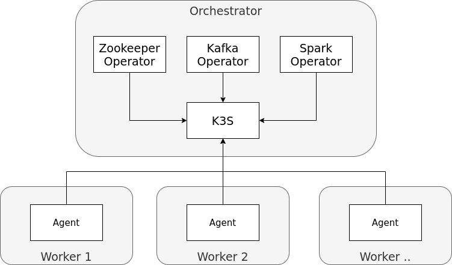

= Stackable Documentation
== Introduction

== Getting Started
Intrigued?
Want to try it out?

The following paragraphs will guide you through setting up all necessary components to create a working Stackable Platform which you can then use to deploy services.

=== Overview
We will perform the following steps in order to arrive at a working platform, the don't absolutely have to be done in the order listed here, but I'd suggest that you know what you are doing and why you are doing it if you want to deviate.

. Install Kubernetes
. Add Nodes to Kubernetes
. Install operators for products

While you can run the entire platform on your laptop, or a single virtual machine, but it is highly recommended to use several machines for the following steps.
The following terms will be used throughout the remainder of this guide:

* *Orchestrator*: A single server which is used to run components that are needed only once
* *Worker*: One or more servers that are intended to run the actual workloads (HDFS, Kafka, ...) later on

NOTE: Going forward, we will assume that you are installing this on several machines, but most commands should work the same in a single-machine scenario.
We will alert you if something needs to be done differently when running everything on the same machine.

.By the end of this guide, the environment that you have set up will look like this

==== Prepare Nodes
Perform the following steps on both the orchestrator and worker nodes.

===== Install Stackable Repository

===== Debian/Ubuntu
In order to be able to verify that the releases have not been tampered with, you'll need to verify and install the PGP key we use to sign these releases.
The key is available on the Ubuntu keyserver under the id _16dd12f5c7a6d76a_ and can be added to your apt keychain with the following command:

    apt-key adv --keyserver keyserver.ubuntu.com --recv-keys 16dd12f5c7a6d76a

To enable the actual repository, put the following content into `/etc/apt/sources.list.d/stackable.list` :

    deb https://repo.stackable.tech/repository/deb-nightly buster main

===== Centos/RHEL

Create the following file in `/etc/yum.repos.d/stackable.repo` :

    [stackable-nightly]
    name=Nighly builds of Stackable components
    baseurl=https://repo.stackable.tech/repository/rpm-nightly/el8
    enabled=1
    gpgcheck=0

=== Install Kubernetes
Usually the installation and configuration of Kubernetes is a full-blown project all of its own, so it might seem a bit weird to find this tucked away in a little section of the quickstart guide like this.
However, the Stackable Platform only uses a very limited subset of the full Kubernetes features, so for our purposes we could actually get away with just running a https://kubernetes.io/docs/reference/command-line-tools-reference/kube-apiserver/[kube-apiserver] and leaving out the entire rest of the https://kubernetes.io/docs/concepts/overview/components/[control-plane].
This makes the deployment a lot simpler.

That being said, Stackable will work with any Kubernetes, please feel free to skip this chapter if you already have a working Kubernetes cluster, or want to use a managed Kubernetes offering like the ones provided by https://www.ionos.com/enterprise-cloud/managed-kubernetes[IONOS], https://cloud.google.com/kubernetes-engine[Google] or https://docs.microsoft.com/en-us/azure/aks/[Azure].

If you choose to follow one of the options mentioned above, feel free to skip ahead to https://xxx[xxx], as you won't need the information in the rest of this chapter.

Since you are still reading this we'll assume that you don't have easy access to an existing Kubernetes and instead install one.
There are numerous possibilities to go about this, but we will focus on https://k3s.io/[K3S], a lightweight Kubernetes distribution that is provided by https://rancher.com/[Rancher].

Run the following command on your _orchestrator_ server:

    curl -sfL https://get.k3s.io | sh -

This will download and install K3S, and configure systemd services to run at startup.
Client tools like `kubectl` will also be installed and configured correctly to connect to Kubernetes.

The installer will also put a client configuration in `

=== Add Nodes to Kubernetes
==== Create KubeConfig
Since our agent registers in Kubernetes very similarly to a regular Kubelet it will need a Kubeconfig to know how and where to connect to Kubernetes.
When we installed K3S, it generated a configuration that clients can use in `/etc/rancher/k3s/server/k3s.yaml` on the orchestrator server.

This file needs to be put on every node of the cluster

==== Install Agent
The distributed component of the Stackable Platform is the agent, which needs to be installed on all managed servers and configured to have access to Kubernetes.

Installing the agent can be done from our rpm and deb package repositories, which we enabled when preparing the nodes above.
The packages also install a systemd service to run the agent, this is not enabled or started by default though

===== RHEL

    sudo yum install stackable-agent

===== Ubuntu

    apt-get install stackable-agent

==== Configuring the agent
When installing from packages the agent config file is created in '/etc/stackable-agent/agent.conf'.

The Agent takes a few configuration options, please refer to https://github.com/stackabletech/agent#command-line-parameters[the agent documentation] for more details.

== Architectural Design Decisions
All relevant decisions concerning the architecture are documented as Architectural Design Records in the subfolder _adr_.

Unfinished or not yet approved decisions are stored in the _adr/drafts_ subfolder.
This folder also contains a template that can be used for creating new decision records.

*Naming Convention* +
When creating a new record, please use the following guidelines for file naming:

 ADR[number]-[name].adoc

During the draft stage please substitute x for the number.
For the name, please use only lower case letters, number and the underscore.
Ideally start the name with the imperative form of a verb and avoid fillers like _of/the/for/..._

Some examples:

* choose_project_language
* choose_repository_structure
* choose_review_mechanism

When choosing the next free number after an ADR has been approved, make sure to left pad the number with 0 to reach a length of three digits.