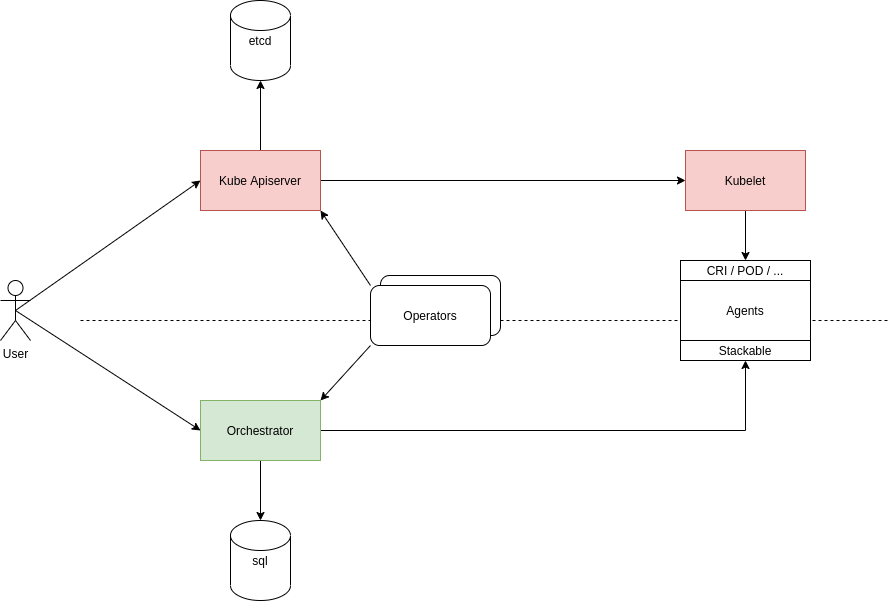

= Decide if Kubernetes Components Are to be Reused for Stackable
Sönke Liebau <soenke.liebau@stackable.de>
v0.1, 27.08.2020
:status: draft

* Status: {status}
* Deciders:
** Florian Waibel
** Lars Francke
** Lukas Menzel
** Oliver Hessel
** Sönke Liebau
* Date: 27.08.2020

== Context and Problem Statement

The Stackable project will need at least two components in order to orchestrate the software that gets deployed.
These components are the orchestrator and the agents that manage bare-metal (or virtual) servers.

During previous design discussions it became quite clear that a lot of the issues that we need to for these components are very similar to issues that Kubernetes faced an the past - and solved already.
Some examples of this are:

* Agents need to register with the orchestrator in a secure way
* The orchestrator needs a mechanism for operators to subscribe to data

In theory, Kubernetes components are extensible enough that it should allow us to implement our components in a way that we can deploy them on top of an existing Kubernetes.
This would save us some work, as we'd for example not have to reimplement the registration process for agents.

The image shows the two main options that we have identified during deliberations so far:

* shaded in red is the option of reusing Kubernetes components (please refer to <<reuse-k8s>> for more details)
* shaded in green is the option of writing our own components (please refer to <<from-scratch>> for more details)

== Decision Drivers

* Avoiding too tight coupling with Kubernetes development & community
* Deployment effort for potential customers

== Considered Options

* Reuse Kubernetes Components
* Start from Scratch

== Decision Outcome

Chosen option: "Start from scratch", because the amount of work that would need to be duplicated seems to be minor, when compared to the flexibility and independence that we can gain by not creating a tight dependence on Kubernetes.

Most prominently, we would need to offer an option to deploy Kubernetes to potential users who do not currently have a Kubernetes cluster.
This in itself is a very large task for which there are numerous companies that tackle it and we have no intention of becoming a Kubernetes distribution.

This option is no decision _against_ Kubernetes for good, but rather a decision for the first iteration of the product.
Integration with Kubernetes can be added later on in incremental steps and provide additional deployment options for customers.

Potential scenarios could for example be:

* Deploy the orchestrator as pod on Kubernetes and keep agents unchanged
* Deploy agents as pods via Kubernetes as well
* Implement CRI to use Kubelet instead of agent for communication

=== Positive Consequences

* Increased flexibility during design, there is no need to
* No need to deploy Kubernetes in addition to our stack for customers without existing Kubernetes installation

=== Negative Consequences

* Duplication of effort that Kubernetes already implemented

== Pros and Cons of the Options

[[reuse-k8s]]
=== Reuse Kubernetes

Stackable needs to deploy a server-client architecture where the decentralized agent receives commands from the central server to execute these.
In order to create an infrastructure like this, there are some functions that need to be in place.
Some examples for these functions are:

* Deploy TLS keys and certificates to agents
* Register agents with orchestrator
* Monitor agents for liveness
* Communication between components
* Tagging and selection of executing nodes
* ...

Most of these functions would be considered _boiler-plate_ and are not exclusive to our intended use-case.
Kubernetes has implemented a lot of this functionality already and we could try to reuse this by deploying our components on top of an existing Kubernetes infrastructure.

The general idea would not be to fork Kubernetes and just reuse the code for our purposes, but rather to deploy the orchestrator as for example an operator in a vanilla Kubernetes cluster and deploying CRDs for our necessary data structures.
This way the operator could subscribe to our resources and publish the necessary downstream structures that Stackable operators would then listen to.

Thinking the concept a bit further we might even get away without an orchestrator as most functionality is taken over by the Kube apiserver already.

* Good, because we do not need to reimplement existing functionality
* Bad, because we have to strictly adhere to Kubernetes structures for everything we do
* Bad, because we would need to marry our release cycles to the very short cycles of Kubernetes
* Bad, because for customers without an existing Kubernetes we would need to somehow provision a Kubernetes cluster
* Bad, because for some customers Kubernetes is not a technology that they want to invest in
* Bad, because we have to keep a very close eye on Kubernetes development to ensure we remain compatible with everything they do

[[from-scratch]]
=== Start from Scratch

We implement the orchestrator and the agent from scratch, instead of reusing any Kubernetes code.
By doing this we gain the flexibility of designing our data structures and APIs as we see fit as well as decoupling us from Kubernetes release cycles.

For this option, it is worth noting, that we will not simply ignore Kubernetes in everything we do, but still pay close attention not to break compatibility with Kubernetes.
This is to ensure that a later move towards Kubernetes does not become overly complex.

* Good, because this does not complicate deployments for customers without existing Kubernetes
* Good, because we don't force customers to use Kubernetes
* Good, because we don't need to adhere to the short Kubernetes release cycles
* Good, because we can design our solution independent of Kubernetes APIs and data structures
* Good, because we do not need to pay too close attention to the Kubernetes community with regards to breaking changes (for us, not for them)
* Bad, because we duplicate some effort that has already been done by the Kubernetes community
* Bad, because we potentially need to implement converters, if our structures differ from Kubernetes
